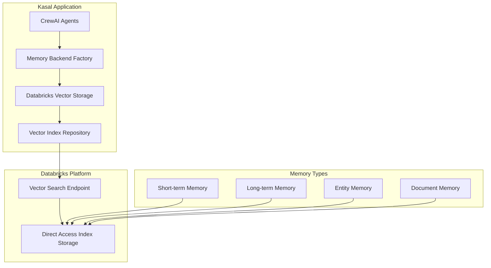

# Databricks Vector Search Integration

## Overview

Kasal integrates with [Databricks Mosaic AI Vector Search](https://docs.databricks.com/en/generative-ai/vector-search.html) to provide scalable, enterprise-grade memory storage for AI agents. This integration enables persistent memory across agent interactions, supporting short-term, long-term, and entity-based memory patterns.

## Architecture

### System Components



### Memory Types and Schemas

Kasal implements four distinct memory types, each optimized for specific use cases:

#### Short-term Memory
Captures recent interactions within a session, providing context for immediate responses.

```python
SHORT_TERM_SCHEMA = {
    "id": "string",                      # Unique identifier
    "content": "string",                  # Memory content
    "query_text": "string",               # Original query for hybrid search
    "session_id": "string",               # Session tracking
    "interaction_sequence": "bigint",     # Order within session
    "timestamp": "string",                # Creation timestamp
    "created_at": "timestamp",            # Precise creation time
    "ttl_hours": "int",                   # Time-to-live for sliding window
    "metadata": "string",                 # JSON metadata
    "crew_id": "string",                  # Crew identifier
    "agent_id": "string",                 # Agent identifier
    "group_id": "string",                 # Tenant isolation
    "llm_model": "string",                # Model that generated this
    "tools_used": "string",               # Tools utilized (JSON array)
    "embedding": "array<float>",          # Vector embedding
    "embedding_model": "string",          # Embedding model used
    "version": "int"                      # Schema version
}
```

#### Long-term Memory
Stores task completions and quality evaluations for future reference.

```python
LONG_TERM_SCHEMA = {
    "id": "string",
    "content": "string",                  # Task outcome/solution
    "task_description": "string",         # Full task description
    "task_hash": "string",                # Hash for exact matching
    "quality": "float",                   # Quality score (0-10)
    "importance": "float",                # Importance weight
    "timestamp": "string",                # Creation time
    "last_accessed": "timestamp",         # Retrieval tracking
    "metadata": "string",                 # JSON metadata
    "crew_id": "string",
    "agent_id": "string",
    "group_id": "string",
    "llm_model": "string",                # Model that completed task
    "tools_used": "string",               # Tools used during task
    "embedding": "array<float>",
    "embedding_model": "string",
    "version": "int"
}
```

#### Entity Memory
Tracks entities, relationships, and attributes discovered during interactions.

```python
ENTITY_SCHEMA = {
    "id": "string",
    "entity_name": "string",              # Entity identifier
    "entity_type": "string",              # Classification (person, org, etc.)
    "description": "string",              # Entity description
    "relationships": "string",            # JSON of related entities
    "timestamp": "string",                # When discovered/updated
    "crew_id": "string",
    "agent_id": "string",
    "group_id": "string",
    "llm_model": "string",                # Model that extracted entity
    "tools_used": "string",               # Extraction tools used
    "embedding": "array<float>",
    "embedding_model": "string"
}
```

#### Document Memory
Stores document embeddings for RAG (Retrieval Augmented Generation) applications.

```python
DOCUMENT_SCHEMA = {
    "id": "string",
    "title": "string",                    # Document title
    "content": "string",                  # Document content
    "source": "string",                   # Source URL/path
    "document_type": "string",            # File type (md, pdf, txt)
    "section": "string",                  # Section within document
    "chunk_index": "int",                 # Chunk position
    "chunk_size": "int",                  # Size in characters
    "parent_document_id": "string",       # Parent document ID
    "created_at": "string",
    "updated_at": "string",
    "doc_metadata": "string",             # JSON metadata
    "group_id": "string",
    "embedding": "array<float>",
    "embedding_model": "string",
    "version": "int"
}
```

## Setup and Configuration

### Prerequisites

1. **Databricks Workspace** with Unity Catalog enabled
2. **Permissions** to create catalogs, schemas, and tables in Unity Catalog
3. **Authentication** is handled automatically by the system

### Deployment Environments

#### Databricks Apps (Recommended)
When deployed as a Databricks App:
- Service Principal authentication is automatic
- Unity Catalog permissions are pre-configured
- Vector Search endpoints can be created within the app context
- No manual authentication setup required

#### Local Development
For local development and testing:
- Set `DATABRICKS_TOKEN` and `DATABRICKS_HOST` environment variables
- Use existing Vector Search endpoints in your workspace
- Ensure your PAT token has appropriate Unity Catalog permissions

### One-Click Setup

Kasal provides automated setup for Databricks Vector Search:

```python
from src.services.databricks_vectorsearch_setup_service import DatabricksVectorSearchSetupService

service = DatabricksVectorSearchSetupService()
result = await service.one_click_databricks_setup(
    workspace_url="https://your-workspace.databricks.com",
    catalog="ml",
    schema="agents",
    embedding_dimension=1024,
    user_token=user_token
)
```

This automatically creates:
- Two Vector Search endpoints (memory and documents)
- Four **Direct Access indexes** for real-time operations:
  - `short_term_memory` - Session-based interactions
  - `long_term_memory` - Task completions and quality evaluations
  - `entity_memory` - Discovered entities and relationships
  - `document_embeddings` - Document chunks for RAG

Direct Access indexes manage their own optimized storage and don't require separate Delta tables.

### Manual Configuration

For existing Databricks infrastructure:

```python
config = DatabricksMemoryConfig(
    workspace_url="https://your-workspace.databricks.com",
    endpoint_name="your-endpoint",
    short_term_index="catalog.schema.short_term_memory",
    long_term_index="catalog.schema.long_term_memory",
    entity_index="catalog.schema.entity_memory",
    document_index="catalog.schema.document_embeddings",
    embedding_dimension=1024,
    embedding_model="databricks-gte-large-en"
)
```

## Authentication

Kasal automatically handles authentication based on your environment:

- **Databricks Apps**: Service Principal credentials are automatically available - no configuration needed
- **Local Development**: Use Personal Access Token (PAT) or OAuth authentication
- **Production**: Service Principal with appropriate Unity Catalog permissions

The system automatically detects and uses the best available authentication method without manual configuration.

## Memory Backend Integration with CrewAI

### Crew Memory Persistence

Kasal's memory backend system integrates seamlessly with CrewAI's memory capabilities, providing persistent storage across executions while maintaining crew and group isolation.

#### Crew ID Generation

Each crew gets a deterministic ID based on its configuration, ensuring consistent memory retrieval across executions:

```python
def _generate_crew_id(self):
    """Generate deterministic crew ID for memory isolation."""
    components = [
        # Agent roles (sorted for consistency)
        *sorted([agent.role for agent in self.agents.values()]),
        # Task descriptions (sorted)
        *sorted([task.description for task in self.tasks]),
        # Model configuration
        self.config.get("model", "default"),
        # Group for tenant isolation
        self.group_context.primary_group_id
    ]
    
    # Hash components for consistent ID
    crew_string = "|".join(components)
    return hashlib.sha256(crew_string.encode()).hexdigest()[:16]
```

This ensures that:
- Same crew configuration always gets the same memory
- Different groups have isolated memories
- Agents remember past interactions within their crew

#### Memory Backend Selection

During crew preparation, the appropriate memory backend is configured:

```python
async def _prepare_memory(self):
    memory_config = self.config.get("memory_backend", {})
    
    if not memory_config or memory_config.get("provider") == "disabled":
        # Use default ChromaDB memory (ephemeral)
        self.memory = True
        return
    
    if memory_config["provider"] == "databricks":
        # Create persistent Databricks memory backend
        from src.memory.databricks_memory import DatabricksMemory
        
        self.memory = DatabricksMemory(
            config=memory_config["config"],
            crew_id=self._generate_crew_id(),
            group_id=self.group_context.primary_group_id
        )
```

## Usage Examples

### Initialize Memory Backend

```python
from src.engines.crewai.memory.memory_backend_factory import MemoryBackendFactory

# Create memory backends for a crew
memory_backends = await MemoryBackendFactory.create_memory_backends(
    config=memory_config,
    crew_id="user_admin_crew_12345",
    embedder=embedder_config,
    user_token=user_token
)
```

### Memory Types in Agent Context

Each memory type serves a specific purpose in the agent workflow:

1. **Short-term Memory**: Captures recent interactions within current execution
2. **Long-term Memory**: Stores successful task completions for future reference  
3. **Entity Memory**: Tracks entities discovered during agent interactions
4. **Document Memory**: Stores embedded documents for RAG applications

### Save Memory

```python
# Save short-term memory during agent execution
await memory_backends['short_term'].save({
    'data': 'User asked about weather in San Francisco',
    'metadata': {
        'session_id': 'session_123',
        'agent': 'Weather Assistant',
        'llm_model': 'gpt-4',
        'tools_used': ['weather_api', 'location_service']
    }
})

# Save long-term memory after task completion
await memory_backends['long_term'].save({
    'content': 'Successfully retrieved weather: 72°F, sunny',
    'task_description': 'Get current weather in San Francisco',
    'quality': 9.5,  # Quality score
    'importance': 8.0,  # Importance weight
    'agent_id': 'weather_assistant',
    'llm_model': 'gpt-4',
    'tools_used': ['weather_api']
})

# Save entity memory when entities are discovered
await memory_backends['entity'].save({
    'entity_name': 'San Francisco',
    'entity_type': 'location',
    'description': 'Major city in Northern California',
    'relationships': ['California', 'Bay Area'],
    'llm_model': 'gpt-4',
    'tools_used': ['entity_extraction']
})
```

### Search Memory

```python
# Search with embedding
results = await memory_backends['long_term'].search(
    query="How to configure Databricks authentication",
    k=5,
    filters={'group_id': 'user_admin'}
)

# Results include enriched context
for result in results:
    print(f"Content: {result['content']}")
    print(f"Agent: {result['agent_id']}")
    print(f"Model: {result['llm_model']}")
    print(f"Tools: {result['tools_used']}")
    print(f"Score: {result['_distance']}")
```

## Performance Optimization

### Index Configuration

Kasal exclusively uses **Direct Access Indexes** for all memory types, providing:
- **Real-time CRUD operations** with immediate consistency
- **Sub-second query latency** for responsive agent interactions
- **Automatic scaling** with endpoint scaling
- **Full control** over data updates and deletions

```python
# All Kasal indexes are created as Direct Access
client.create_direct_access_index(
    endpoint_name="kasal_memory_endpoint",
    index_name="catalog.schema.memory_table",
    primary_key="id",
    embedding_dimension=1024,
    embedding_vector_column="embedding"
)
```

> **Note**: Databricks also offers Managed Indexes for batch updates and cost optimization scenarios. While not used in Kasal, you can learn more about them in the [Databricks Vector Search documentation](https://docs.databricks.com/en/generative-ai/vector-search.html#managed-versus-direct-access-index)

### Query Optimization

```python
# Optimized search with filters
results = await repository.similarity_search(
    index_name=index_name,
    query_embedding=embedding,
    k=10,
    filters={
        'crew_id': crew_id,
        'timestamp': {'$gte': '2024-01-01'}
    },
    columns=['id', 'content', 'agent_id', 'llm_model', 'tools_used']
)
```

## Monitoring and Observability

### Logging Configuration

Kasal provides dedicated loggers for each memory type:

```python
from src.core.logger import LoggerManager

# Memory-specific loggers
short_term_logger = LoggerManager.get_instance().databricks_short_term
long_term_logger = LoggerManager.get_instance().databricks_long_term
entity_logger = LoggerManager.get_instance().databricks_entity
```

### Metrics and Monitoring

Monitor index performance through Databricks:

```sql
-- Query index statistics
SELECT * FROM system.vector_search.index_metrics
WHERE index_name = 'catalog.schema.memory_table'
ORDER BY timestamp DESC
LIMIT 100;

-- Monitor query latency
SELECT 
    date_trunc('hour', timestamp) as hour,
    AVG(query_latency_ms) as avg_latency,
    P90(query_latency_ms) as p90_latency,
    COUNT(*) as query_count
FROM system.vector_search.query_logs
WHERE index_name = 'catalog.schema.memory_table'
GROUP BY 1
ORDER BY 1 DESC;
```

## Security Considerations

### Data Isolation

Kasal implements multi-level isolation:

1. **Group Isolation**: Each group's memories are completely separated
2. **Crew Isolation**: Memories are tagged with crew_id for filtering
3. **Agent Attribution**: Each memory records the agent that created it

### Access Control

```python
# All queries automatically filtered by group_id
filters = {
    'group_id': current_user.group_id,
    'crew_id': crew_id
}
```

### Encryption

- **At Rest**: Direct Access indexes are encrypted using Databricks platform encryption
- **In Transit**: TLS 1.2+ for all API communications
- **Credentials**: Store using Databricks Secrets or environment variables

## Troubleshooting

### Common Issues

#### Index Not Ready
```python
# Wait for index to be ready
async def wait_for_index(index_name, max_wait=300):
    start_time = time.time()
    while time.time() - start_time < max_wait:
        status = await repository.get_index_status(index_name)
        if status == 'READY':
            return True
        await asyncio.sleep(10)
    raise TimeoutError(f"Index {index_name} not ready after {max_wait}s")
```

#### Authentication Issues
```python
# Authentication is handled automatically
# In Databricks Apps: Service Principal is pre-configured
# For local development: Ensure PAT token is set
if is_databricks_apps_environment():
    # Automatic Service Principal authentication
    logger.info("Using Databricks Apps Service Principal")
else:
    # Local development - check for PAT token
    if not os.getenv('DATABRICKS_TOKEN'):
        logger.error("Set DATABRICKS_TOKEN environment variable for local development")
```

#### Memory Not Persisting
```python
# Verify memory is being saved
save_result = await storage.save(data)
if not save_result.get('success'):
    logger.error(f"Failed to save memory: {save_result.get('error')}")
    # Check index status
    index_status = await repository.describe_index(index_name)
    logger.info(f"Index status: {index_status}")
```

### Debug Mode

Enable detailed logging:

```python
import logging

# Enable debug logging for memory operations
logging.getLogger('kasal.databricks_vector_search').setLevel(logging.DEBUG)
logging.getLogger('kasal.databricks_short_term').setLevel(logging.DEBUG)
logging.getLogger('kasal.databricks_entity').setLevel(logging.DEBUG)
```

## API Reference

### Memory Backend Service

```python
class MemoryBackendService:
    async def get_or_create_default_config(
        self, group_id: str
    ) -> Optional[MemoryBackendResponse]
    
    async def update_config(
        self, config_id: UUID, updates: MemoryBackendUpdate
    ) -> MemoryBackendResponse
    
    async def test_databricks_connection(
        self, workspace_url: str, **auth_params
    ) -> Dict[str, Any]
    
    async def search_vectors(
        self, index_name: str, query_embedding: List[float], 
        k: int = 5, filters: Optional[Dict] = None
    ) -> List[Dict[str, Any]]
```

### Vector Index Repository

```python
class DatabricksVectorIndexRepository:
    async def create_index(
        self, index_data: IndexCreate
    ) -> IndexResponse
    
    async def upsert(
        self, index_name: str, data: List[Dict]
    ) -> Dict[str, Any]
    
    async def similarity_search(
        self, index_name: str, query_embedding: List[float],
        k: int = 5, filters: Optional[Dict] = None
    ) -> List[Dict[str, Any]]
    
    async def delete_records(
        self, index_name: str, primary_keys: List[str]
    ) -> Dict[str, Any]
```

## Memory Isolation and Multi-Tenancy

### Group-Level Isolation

Kasal implements strict memory isolation at the group level:

```python
# All memory operations are automatically filtered by group_id
async def search_memory(self, query: str, crew_id: str, group_id: str):
    filters = {
        'group_id': group_id,  # Tenant isolation
        'crew_id': crew_id      # Crew-specific memories
    }
    
    results = await self.repository.similarity_search(
        index_name=self.index_name,
        query_embedding=await self.generate_embedding(query),
        filters=filters,
        k=10
    )
    return results
```

### Crew-Level Persistence

Memories persist across executions for the same crew configuration:

```python
# Example: A customer service crew remembers past interactions
crew_config = {
    "agents_yaml": {
        "support_agent": {
            "role": "Customer Support Specialist",
            "memory": True  # Enable memory for this agent
        }
    },
    "memory_backend": {
        "provider": "databricks",
        "config": {...}
    }
}

# First execution - agent learns about customer
# Second execution - agent remembers customer preferences
# Memory persists because crew_id remains consistent
```

## Best Practices

### 1. Memory Lifecycle Management

```python
# Implement TTL for short-term memory
async def cleanup_expired_memories():
    cutoff_time = datetime.now() - timedelta(hours=24)
    await repository.delete_records(
        index_name=short_term_index,
        filters={'created_at': {'$lt': cutoff_time.isoformat()}}
    )

# Implement memory pruning for cost optimization
async def prune_low_quality_memories():
    # Remove memories with low quality scores
    await repository.delete_records(
        index_name=long_term_index,
        filters={'quality': {'$lt': 5.0}}
    )
```

### 2. Batch Operations

```python
# Batch upsert for better performance
memories = []
for interaction in session_interactions:
    memories.append({
        'id': str(uuid.uuid4()),
        'content': interaction.content,
        'embedding': await generate_embedding(interaction.content),
        # ... other fields
    })

# Single batch operation
await repository.upsert(index_name, memories)
```

### 3. Error Handling

```python
from tenacity import retry, stop_after_attempt, wait_exponential

@retry(
    stop=stop_after_attempt(3),
    wait=wait_exponential(multiplier=1, min=4, max=10)
)
async def robust_memory_save(storage, data):
    try:
        return await storage.save(data)
    except Exception as e:
        logger.error(f"Memory save failed: {e}")
        # Implement fallback logic
        raise
```

### 4. Cost Optimization

- Use Direct Access indexes for frequently accessed memories
- Implement memory pruning for old short-term memories
- Monitor query patterns and optimize index configuration
- Use appropriate embedding dimensions for your use case

## Additional Resources

- [Databricks Vector Search Documentation](https://docs.databricks.com/en/generative-ai/vector-search.html)
- [Unity Catalog Documentation](https://docs.databricks.com/en/data-governance/unity-catalog/index.html)
- [Databricks SDK for Python](https://docs.databricks.com/en/dev-tools/sdk-python.html)
- [CrewAI Memory Documentation](https://docs.crewai.com/memory)