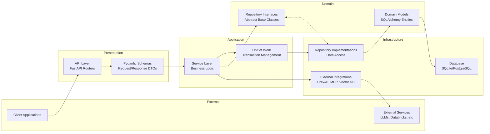
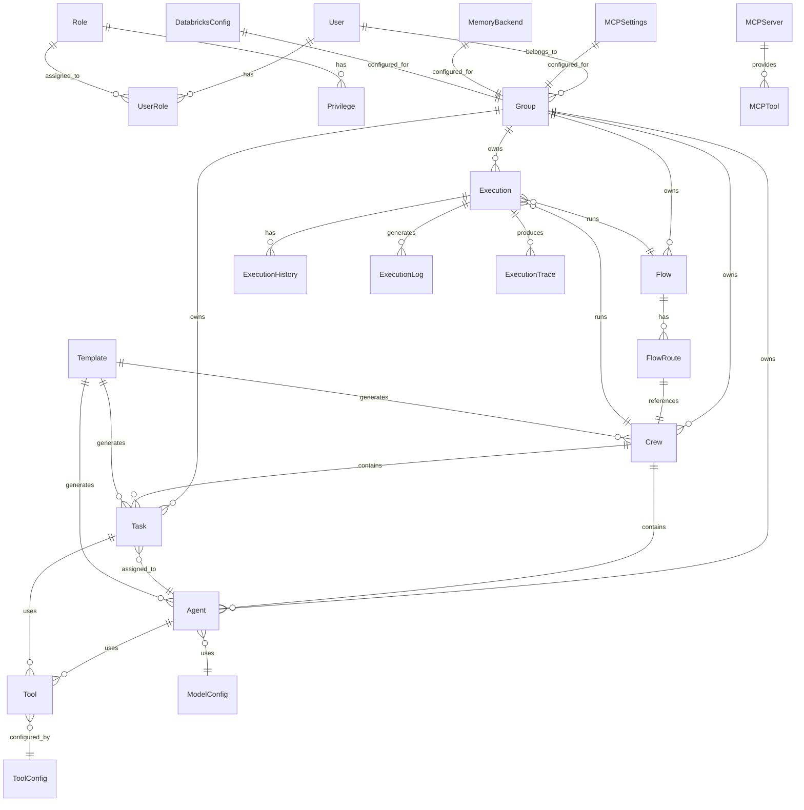
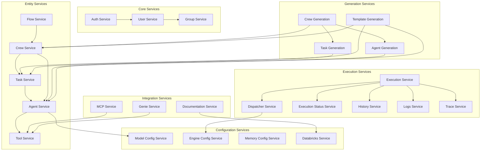
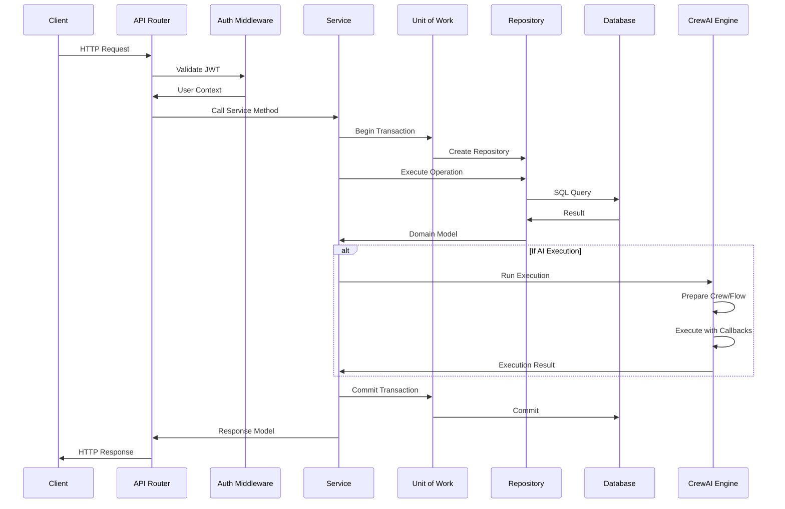
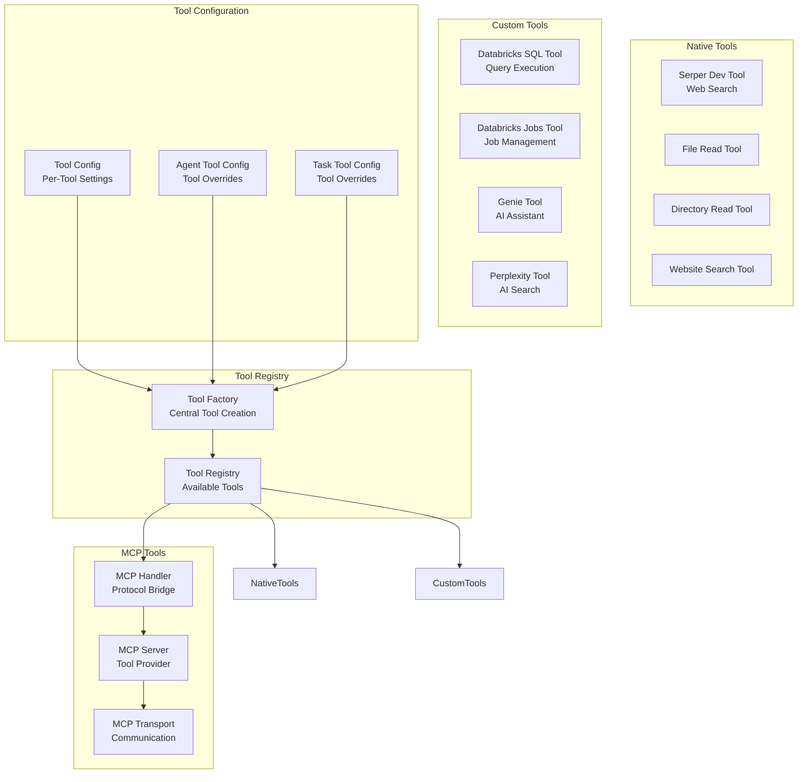
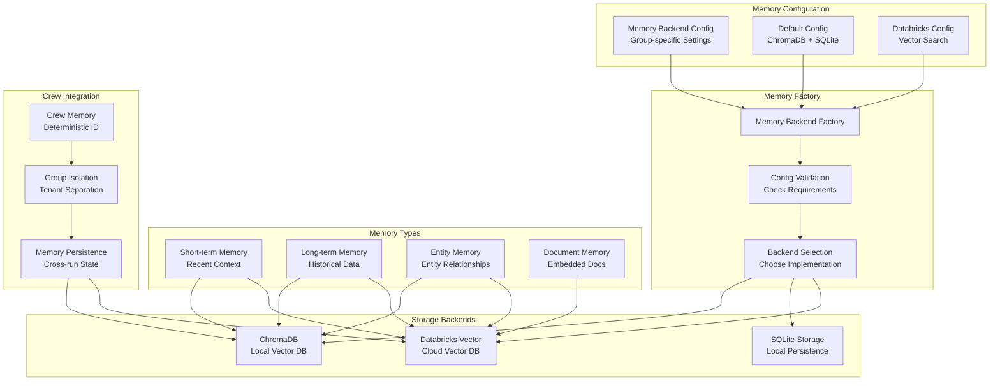
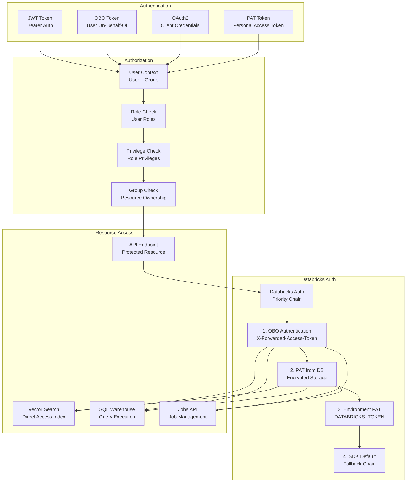

# Kasal Backend Architecture Visualization

This document provides a comprehensive visualization of the Kasal backend architecture using Mermaid diagrams.

## Overall Architecture

```mermaid
graph TB
    subgraph "Client Layer"
        Web[Web Browser]
        API[API Clients]
    end

    subgraph "API Layer - FastAPI Routers"
        Auth[Auth Router]
        Agents[Agents Router]
        Tasks[Tasks Router]
        Crews[Crews Router]
        Exec[Executions Router]
        Flow[Flows Router]
        MCP[MCP Router]
        Genie[Genie Router]
        DB[Databricks Router]
        Memory[Memory Backend Router]
        Tools[Tools Router]
        Templates[Templates Router]
        Models[Models Router]
        Docs[Documentation Router]
    end

    subgraph "Service Layer - Business Logic"
        AuthSvc[Auth Service]
        AgentSvc[Agent Service]
        TaskSvc[Task Service]
        CrewSvc[Crew Service]
        ExecSvc[Execution Service]
        FlowSvc[Flow Service]
        MCPSvc[MCP Service]
        GenieSvc[Genie Service]
        DBSvc[Databricks Service]
        MemSvc[Memory Service]
        ToolSvc[Tool Service]
        TemplateSvc[Template Service]
        ModelSvc[Model Config Service]
        DocSvc[Documentation Service]
        DispatcherSvc[Dispatcher Service]
    end

    subgraph "Repository Layer - Data Access"
        UOW[Unit of Work]
        AgentRepo[Agent Repository]
        TaskRepo[Task Repository]
        CrewRepo[Crew Repository]
        ExecRepo[Execution Repository]
        FlowRepo[Flow Repository]
        MCPRepo[MCP Repository]
        GenieRepo[Genie Repository]
        DBRepo[Databricks Repository]
        MemRepo[Memory Backend Repository]
        ToolRepo[Tool Repository]
        TemplateRepo[Template Repository]
        ModelRepo[Model Config Repository]
        DocRepo[Documentation Repository]
    end

    subgraph "Database Layer"
        SQLite[(SQLite Dev)]
        PostgreSQL[(PostgreSQL Prod)]
        VectorDB[(Vector Storage)]
    end

    subgraph "AI Engine Layer - CrewAI"
        CrewAIEngine[CrewAI Engine Service]
        CrewPrep[Crew Preparation]
        FlowPrep[Flow Preparation]
        ConfigAdapter[Config Adapter]
        ExecRunner[Execution Runner]
        ToolFactory[Tool Factory]
        MCPIntegration[MCP Integration]
        Callbacks[Execution Callbacks]
        MemoryBackend[Memory Backend Factory]
        
        subgraph "Helpers"
            AgentHelpers[Agent Helpers]
            TaskHelpers[Task Helpers]
            ToolHelpers[Tool Helpers]
            ConversionHelpers[Conversion Helpers]
            ModelConvHandler[Model Conversion Handler]
        end
    end

    Web --> Auth
    API --> Auth
    
    Auth --> AuthSvc
    Agents --> AgentSvc
    Tasks --> TaskSvc
    Crews --> CrewSvc
    Exec --> DispatcherSvc
    Flow --> FlowSvc
    MCP --> MCPSvc
    Genie --> GenieSvc
    DB --> DBSvc
    Memory --> MemSvc
    Tools --> ToolSvc
    Templates --> TemplateSvc
    Models --> ModelSvc
    Docs --> DocSvc

    AuthSvc --> UOW
    AgentSvc --> UOW
    TaskSvc --> UOW
    CrewSvc --> UOW
    ExecSvc --> UOW
    FlowSvc --> UOW
    MCPSvc --> UOW
    GenieSvc --> UOW
    DBSvc --> UOW
    MemSvc --> UOW
    ToolSvc --> UOW
    TemplateSvc --> UOW
    ModelSvc --> UOW
    DocSvc --> UOW

    DispatcherSvc --> ExecSvc
    DispatcherSvc --> CrewAIEngine

    UOW --> AgentRepo
    UOW --> TaskRepo
    UOW --> CrewRepo
    UOW --> ExecRepo
    UOW --> FlowRepo
    UOW --> MCPRepo
    UOW --> GenieRepo
    UOW --> DBRepo
    UOW --> MemRepo
    UOW --> ToolRepo
    UOW --> TemplateRepo
    UOW --> ModelRepo
    UOW --> DocRepo

    AgentRepo --> SQLite
    AgentRepo --> PostgreSQL
    TaskRepo --> SQLite
    TaskRepo --> PostgreSQL
    CrewRepo --> SQLite
    CrewRepo --> PostgreSQL
    ExecRepo --> SQLite
    ExecRepo --> PostgreSQL
    FlowRepo --> SQLite
    FlowRepo --> PostgreSQL
    MCPRepo --> SQLite
    MCPRepo --> PostgreSQL
    GenieRepo --> SQLite
    GenieRepo --> PostgreSQL
    DBRepo --> SQLite
    DBRepo --> PostgreSQL
    MemRepo --> SQLite
    MemRepo --> PostgreSQL
    ToolRepo --> SQLite
    ToolRepo --> PostgreSQL
    TemplateRepo --> SQLite
    TemplateRepo --> PostgreSQL
    ModelRepo --> SQLite
    ModelRepo --> PostgreSQL
    DocRepo --> VectorDB

    CrewAIEngine --> CrewPrep
    CrewAIEngine --> FlowPrep
    CrewAIEngine --> ConfigAdapter
    CrewAIEngine --> ExecRunner
    CrewPrep --> AgentHelpers
    CrewPrep --> TaskHelpers
    CrewPrep --> ToolFactory
    FlowPrep --> ToolFactory
    AgentHelpers --> ModelConvHandler
    TaskHelpers --> ConversionHelpers
    ToolFactory --> ToolHelpers
    ToolFactory --> MCPIntegration
    ExecRunner --> Callbacks
    CrewPrep --> MemoryBackend
```

## Clean Architecture Layers

## CrewAI Engine Integration

```mermaid
graph TB
    subgraph "Execution Flow"
        Request[Execution Request]
        Dispatcher[Dispatcher Service]
        Engine[CrewAI Engine Service]
        ExecSvc[Execution Service]
        Status[Execution Status Service]
    end

    subgraph "CrewAI Components"
        ConfigAdapter[Config Adapter<br/>Normalizes Configuration]
        CrewPrep[Crew Preparation<br/>Builds Agents & Tasks]
        FlowPrep[Flow Preparation<br/>Builds Flow & Routes]
        ExecRunner[Execution Runner<br/>Runs Crew/Flow]
        TraceManager[Trace Manager<br/>Execution Tracing]
    end

    subgraph "Helper Modules"
        AgentHelper[Agent Helpers<br/>Agent Creation & Config]
        TaskHelper[Task Helpers<br/>Task Creation & Deps]
        ToolHelper[Tool Helpers<br/>Tool Resolution]
        ConvHelper[Conversion Helpers<br/>Type Conversions]
        ModelConvHandler[Model Conversion Handler<br/>LLM Config]
        TaskCallbacks[Task Callbacks<br/>Task Event Handling]
    end

    subgraph "Tool System"
        ToolFactory[Tool Factory]
        NativeTools[Native Tools<br/>Built-in CrewAI]
        CustomTools[Custom Tools<br/>Databricks, Genie, Perplexity]
        MCPTools[MCP Tools<br/>Model Context Protocol]
        MCPHandler[MCP Handler<br/>MCP Integration]
    end

    subgraph "Memory System"
        MemFactory[Memory Backend Factory]
        ShortTerm[Short-term Memory]
        LongTerm[Long-term Memory]
        Entity[Entity Memory]
        VectorStorage[Vector Storage<br/>Databricks/ChromaDB]
    end

    subgraph "Callbacks & Monitoring"
        CallbackManager[Callback Manager]
        ExecCallback[Execution Callback<br/>Trace & Logs]
        StreamCallback[Streaming Callback<br/>Real-time Updates]
        StorageCallback[Storage Callback<br/>Result Persistence]
        LoggingCallback[Logging Callbacks<br/>Event Logging]
        ValidationCallback[Validation Callbacks<br/>Output Validation]
    end

    Request --> Dispatcher
    Dispatcher --> ExecSvc
    Dispatcher --> Engine
    Engine --> Status
    ExecSvc --> Status

    Engine --> ConfigAdapter
    ConfigAdapter --> CrewPrep
    ConfigAdapter --> FlowPrep
    
    CrewPrep --> AgentHelper
    CrewPrep --> TaskHelper
    AgentHelper --> ModelConvHandler
    TaskHelper --> ConvHelper
    TaskHelper --> TaskCallbacks
    
    CrewPrep --> ExecRunner
    FlowPrep --> ExecRunner
    ExecRunner --> TraceManager

    CrewPrep --> ToolFactory
    ToolFactory --> ToolHelper
    ToolFactory --> NativeTools
    ToolFactory --> CustomTools
    ToolFactory --> MCPHandler
    MCPHandler --> MCPTools

    CrewPrep --> MemFactory
    MemFactory --> ShortTerm
    MemFactory --> LongTerm
    MemFactory --> Entity
    ShortTerm --> VectorStorage
    LongTerm --> VectorStorage
    Entity --> VectorStorage

    ExecRunner --> CallbackManager
    CallbackManager --> ExecCallback
    CallbackManager --> StreamCallback
    CallbackManager --> StorageCallback
    CallbackManager --> LoggingCallback
    CallbackManager --> ValidationCallback
```

## Database Schema Relationships

## Service Layer Dependencies

## Request Flow Sequence

## Tool System Architecture

## Memory Backend Architecture

## Authentication & Authorization Flow

## Key Architecture Principles

1. **Clean Architecture**: Strict separation of concerns with clear boundaries between layers
2. **Repository Pattern**: All database access through repositories for abstraction
3. **Unit of Work**: Transaction management ensuring atomic operations
4. **Dependency Injection**: FastAPI's DI system for loose coupling
5. **Async-First**: All I/O operations are async for performance
6. **Group Isolation**: Complete tenant separation for multi-tenancy
7. **Deterministic IDs**: Consistent crew IDs for memory persistence
8. **Schema Layer**: Centralized schema definitions for consistency
9. **Authentication Chain**: Flexible auth with fallback mechanisms
10. **Event-Driven**: Callbacks and events for real-time updates

## Technology Stack

- **Framework**: FastAPI (async Python web framework)
- **ORM**: SQLAlchemy 2.0 (async support)
- **Database**: SQLite (dev) / PostgreSQL (prod)
- **AI Engine**: CrewAI (agent orchestration)
- **Vector DB**: Databricks Vector Search / ChromaDB
- **Authentication**: JWT with Databricks OAuth
- **Validation**: Pydantic schemas
- **Testing**: Pytest with async support
- **Migration**: Alembic for database migrations